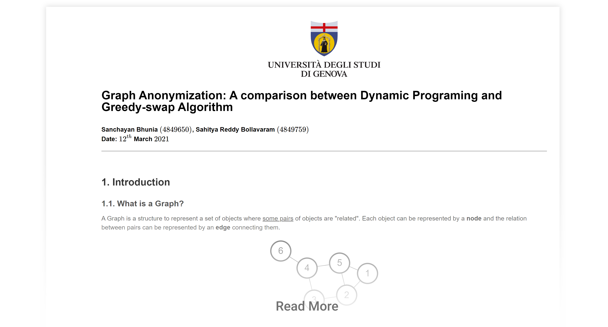

# Degree Anonymization of a Graph

Graph database and datastructures are used everywhere to store data starting from social networks, VPN providers to a bank's customer information. 
The privacy is secured while data used in the organization internally. The moment an organization either outsource the data to a third party, the privacy of the customer is lost. 
But sometimes, an organization needs  outsource the data for analysis or to build a data centric application. In that case, securing the privacy of its customers is one 
of the primary concern of the organization. 

There are multiple algorithms to anonymize graphs a.k.a. networks namely, greedy swap and dynamic programming with execution time and accuracy being the trade-off. 
Here in this project we have discovered two more algorithms which stands in-between and <strong>almost 1000 times faster than dynamic programming and while keeping the accuracy intact.</strong>

The methods and the theoretical part is illustrated in the Jupyter Notebook and hosted on github pages. The algorithms are implemented as in the python modules in this repository.

Link to view the hosted notebook file is below:

